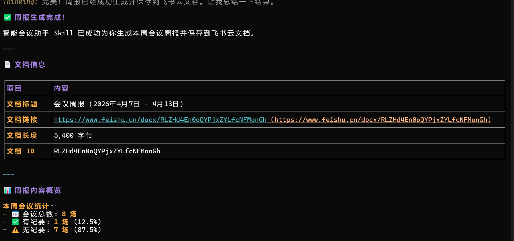
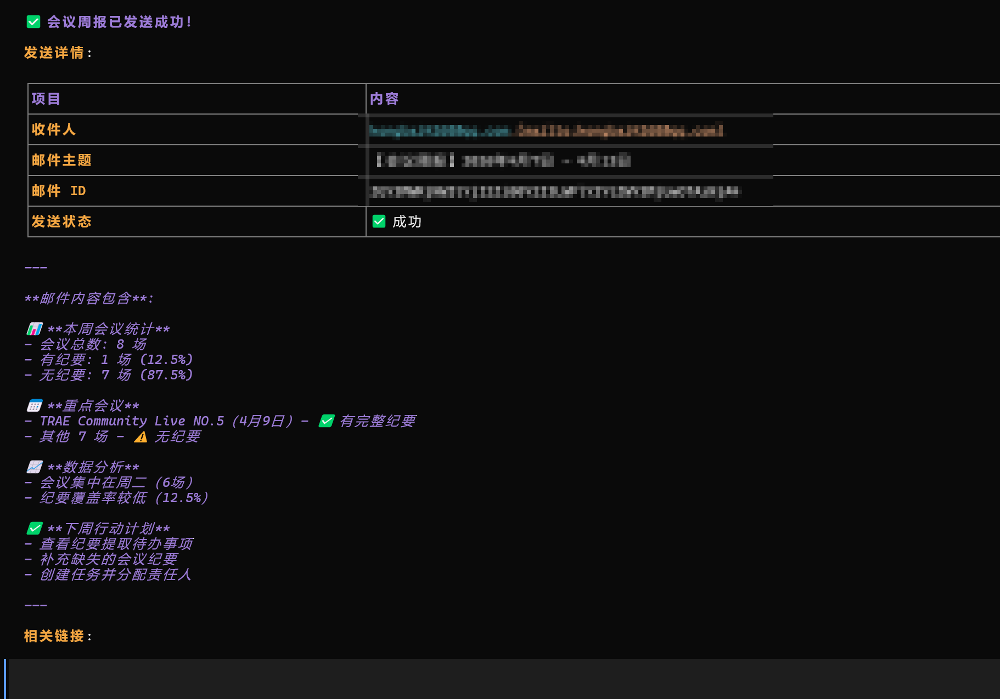

# 智能会议助手 (lark-smart-meeting-assistant)

<div align="center">


**让 AI 帮您处理会议，专注于更重要的事情！**

</div>

## 📸 功能演示

<div align="center">





</div>

## 📖 简介

智能会议助手是一个基于飞书 CLI 的自动化工具，专门用于会议全生命周期的管理。它能够自动获取会议纪要、智能提取待办事项、创建飞书任务、发送会议总结邮件、生成结构化的会议报告，还支持会议提醒和任务状态跟踪。

### 🎯 解决的问题

- ❌ **手动整理会议纪要**：自动获取和整理会议内容
- ❌ **遗漏待办事项**：智能提取并创建任务
- ❌ **忘记跟进**：自动发送总结邮件
- ❌ **会议数据分散**：生成结构化报告
- ❌ **错过重要会议**：智能会议提醒
- ❌ **任务延期**：任务状态跟踪和提醒

## 🎯 核心功能

| 功能 | 描述 |
|------|------|
| 🎥 **自动获取会议纪要** | 查询指定时间范围内的会议记录和纪要 |
| ✅ **智能提取待办事项** | 从纪要中识别任务、负责人、截止时间 |
| 📋 **创建飞书任务** | 自动将待办事项创建为飞书任务并分配给相关人员 |
| 📧 **发送会议总结** | 自动生成会议总结并发送给参会人 |
| 📊 **生成会议报告** | 创建结构化的会议周报或日报 |
| 🔔 **会议提醒** | 为即将到来的会议设置提醒 |
| 📈 **任务状态跟踪** | 监控任务完成状态，提醒即将到期的任务 |
| 📉 **会议数据分析** | 分析会议数据，生成可视化报告 |

## 🚀 快速开始

### 前置要求

- ✅ 已安装 Node.js (v16+)
- ✅ 已安装飞书 CLI
- ✅ 已配置飞书账号

### 1. 安装飞书 CLI

```bash
# 全局安装飞书 CLI
npm install -g @larksuite/cli

# 安装官方 Skills
npx skills add https://github.com/larksuite/cli -y -g
```

### 2. 配置和授权

```bash
# 初始化配置（首次使用）
lark-cli config init

# 授权登录（需要访问会议、任务、邮件等）
lark-cli auth login --domain vc,drive,task,mail,doc
```

**授权说明**：
- `vc`: 查询会议记录和纪要
- `drive`: 读取纪要文档内容
- `task`: 创建和管理任务
- `mail`: 发送会议总结邮件
- `doc`: 生成会议报告文档

### 3. 安装本 Skill

#### 🌟 方式 1：通过 GitHub 仓库链接安装（推荐）

```bash
# 直接使用 GitHub 仓库链接安装
npx skills add https://github.com/mmmnhjgh/lark-smart-meeting-assistant -y -g
```

**优势**：
- ✅ 一键安装，无需手动下载
- ✅ 自动获取最新版本
- ✅ 适合分享给其他用户

#### 📦 方式 2：手动安装

```bash
# Linux/macOS
cp -r lark-smart-meeting-assistant ~/.trae-cn/skills/

# Windows
xcopy /E /I lark-smart-meeting-assistant %USERPROFILE%\.trae-cn\skills\
```

### 4. 验证安装

```bash
# 查看已安装的 Skills
npx skills list

# 应该能看到 lark-smart-meeting-assistant
```

### 5. 开始使用

#### 方式 1：在 AI Agent 中使用

在 AI Agent（如 OpenCode、Claude Code）中直接使用自然语言：

```
帮我处理今天的会议纪要
```

AI Agent 会自动：
1. 查询今天的会议记录
2. 获取每个会议的纪要
3. 读取纪要内容
4. 提取待办事项
5. 创建飞书任务
6. 发送会议总结邮件

#### 方式 2：使用会议提醒脚本

```bash
# 为即将到来的会议创建提醒
./meeting-reminder.sh -r

# 跟踪任务状态
./meeting-reminder.sh -t
```

#### 方式 3：配置自定义设置

```bash
# 复制配置文件模板
cp config.example.json config.json

# 编辑配置文件
vim config.json
```

**配置文件说明**：
- `meeting.default_time_range`：默认时间范围设置
- `meeting.reminder`：会议提醒设置
- `task.default_assignee`：默认任务负责人
- `task.status_tracking`：任务状态跟踪设置
- `mail.template`：邮件模板设置
- `report`：报告生成设置

## 💡 使用场景

### 场景 1：处理今天的会议

**用户输入**：
```
帮我查看今天的会议，获取纪要，提取待办事项并创建任务
```

**AI Agent 自动执行**：
```bash
# 1. 查询今天的会议
lark-cli vc +search --start "2026-04-08" --end "2026-04-08" --format json

# 2. 获取会议纪要
lark-cli vc +notes --meeting-ids "<meeting_id>"

# 3. 读取纪要内容
lark-cli docs +fetch --doc "<note_doc_token>"

# 4. 创建任务
lark-cli task +create --summary "完成需求文档" --assignee "<user_id>"

# 5. 发送总结邮件
lark-cli mail +send --to "<email>" --subject "会议总结" --body "<内容>"
```

### 场景 2：生成本周会议报告

**用户输入**：
```
帮我整理本周的会议内容，生成一份会议周报
```

**AI Agent 自动执行**：
```bash
# 1. 查询本周会议
lark-cli vc +search --start "2026-04-07" --end "2026-04-13" --format json

# 2. 批量获取纪要
lark-cli vc +notes --meeting-ids "id1,id2,id3"

# 3. 生成报告文档
lark-cli docs +create --title "本周会议报告" --markdown "<报告内容>"
```

### 场景 3：会议后自动跟进

**用户输入**：
```
会议结束后，自动发送总结邮件给参会人，并创建待办任务
```

**AI Agent 自动执行**：
- 提取会议纪要中的待办事项
- 识别负责人和截止时间
- 创建飞书任务并分配
- 生成会议总结邮件
- 发送给所有参会人

### 场景 4：设置会议提醒

**用户输入**：
```
为未来一周的会议设置提醒
```

**AI Agent 自动执行**：
```bash
# 1. 查询未来一周的会议
lark-cli vc +search --start "2026-04-09" --end "2026-04-16" --status upcoming --format json

# 2. 为每个会议创建提醒任务
lark-cli task +create --summary "[会议提醒] 项目评审会" --assignee "<user_id>" --due "2026-04-10"
```

### 场景 5：跟踪任务状态

**用户输入**：
```
查看我当前的待办任务，提醒即将到期的任务
```

**AI Agent 自动执行**：
```bash
# 1. 获取待处理任务
lark-cli task +get-my-tasks --status in_progress --format json

# 2. 检查即将到期的任务
# 基于任务的截止日期进行筛选和提醒
```

### 场景 6：会议数据分析

**用户输入**：
```
分析本月的会议数据，生成数据分析报告
```

**AI Agent 自动执行**：
```bash
# 1. 查询本月会议数据
lark-cli vc +search --start "2026-04-01" --end "2026-04-30" --format json

# 2. 分析会议数据
# 统计会议数量、时长、分布等

# 3. 生成分析报告
lark-cli docs +create --title "会议数据分析报告 (2026-04)" --markdown "<分析内容>"
```

## 📋 工作流程

### 会议后处理流程

```
会议结束
    │
    ▼
查询会议记录 (vc +search)
    │
    ▼
获取会议纪要 (vc +notes)
    │
    ▼
提取待办事项 (AI 分析)
    │
    ▼
创建飞书任务 (task +create)
    │
    ▼
发送会议总结 (mail +send)
    │
    ▼
生成报告文档 (docs +create)
```

### 会议提醒流程

```
定期检查
    │
    ▼
查询即将到来的会议 (vc +search)
    │
    ▼
为会议创建提醒任务 (task +create)
    │
    ▼
任务到期提醒
```

### 任务状态跟踪流程

```
定期检查
    │
    ▼
获取待处理任务 (task +get-my-tasks)
    │
    ▼
检查任务截止日期
    │
    ▼
提醒即将到期的任务
    │
    ▼
更新任务状态 (task +complete)
```

## 🔧 技术架构

本 Skill 基于飞书 CLI 1.0.7+ 的以下能力：

| 模块 | 功能 | 命令示例 |
|------|------|----------|
| **vc** | 会议记录查询、纪要获取（支持从日历事件提取纪要令牌） | `lark-cli vc +search`, `lark-cli vc +notes` |
| **drive** | 文档元数据查询 | `lark-cli drive metas batch_query` |
| **docs** | 文档内容读取和创建（支持 media-preview） | `lark-cli docs +fetch`, `lark-cli docs +create` |
| **task** | 任务创建和管理 | `lark-cli task +create`, `lark-cli task +get-my-tasks` |
| **mail** | 邮件发送（支持 send_as 别名、发现发送者） | `lark-cli mail +send`, `lark-cli mail +discover-senders` |
| **contact** | 用户信息查询 | `lark-cli contact search-user` |
| **auth** | 权限管理和授权 | `lark-cli auth login`, `lark-cli auth status` |
| **wiki** | Wiki 节点创建 | `lark-cli wiki +create` |

### 飞书 CLI 1.0.7 新特性（2026-04-09）

本 Skill 已更新支持飞书 CLI 1.0.7 的最新功能：

1. **VC 模块增强**：支持从日历事件关系 API 提取纪要文档令牌，提供更灵活的会议纪要获取方式
2. **Mail 模块增强**：新增 `send_as` 别名支持、邮箱/发送者发现 API、邮件规则 API
3. **Docs 模块增强**：新增 `media-preview` 快捷方式，支持额外的搜索过滤器
4. **Sheets 模块增强**：新增 `+write-image` 快捷方式
5. **Wiki 模块增强**：新增 wiki 节点创建快捷方式
6. **通用改进**：自动授予机器人创建的文档、表格、导入和上传当前用户访问权限

## 📝 详细命令示例

### 查询会议记录

```bash
# 查询今天的会议
lark-cli vc +search --start "2026-04-08" --end "2026-04-08" --format json

# 查询本周的会议
lark-cli vc +search --start "2026-04-07" --end "2026-04-13" --format json

# 查询指定时间范围的会议（最多 30 条）
lark-cli vc +search --start "<YYYY-MM-DD>" --end "<YYYY-MM-DD>" --format json --page-size 30
```

**重要提示**：
- 时间范围最大为 1 个月，超过需分批查询
- `--end` 为包含当天的日期
- 有 `page_token` 时必须继续翻页
- 使用 `--format json` 便于 AI 解析

### 获取会议纪要

```bash
# 获取单个会议的纪要
lark-cli vc +notes --meeting-ids "<meeting_id>"

# 批量获取多个会议的纪要（最多 50 个）
lark-cli vc +notes --meeting-ids "id1,id2,id3"
```

**返回信息**：
- `note_doc_token`: 纪要文档 Token
- `verbatim_doc_token`: 逐字稿文档 Token
- 部分会议可能返回 "no notes available"

### 读取纪要文档内容

```bash
# 先查看参数结构
lark-cli schema drive.metas.batch_query

# 批量获取纪要文档链接（一次最多 10 个）
lark-cli drive metas batch_query --data '{
  "request_docs": [
    {"doc_type": "docx", "doc_token": "<note_doc_token>"}
  ],
  "with_url": true
}'

# 获取文档内容
lark-cli docs +fetch --doc "<doc_url_or_token>"
```

### 创建飞书任务

```bash
# 创建单个任务
lark-cli task +create \
  --summary "完成需求文档" \
  --assignee "<user_open_id>" \
  --due "2026-04-11" \
  --description "会议纪要中提到的待办事项"

# 创建任务并添加到任务列表
lark-cli task +create \
  --summary "任务描述" \
  --assignee "<user_open_id>" \
  --tasklist "<tasklist_id>"
```

**参数说明**：
- `--summary`: 任务标题（必需）
- `--assignee`: 负责人的 open_id
- `--due`: 截止日期（YYYY-MM-DD 格式）
- `--description`: 任务详细描述
- `--tasklist`: 任务列表 ID（可选）

### 发送会议总结邮件

```bash
# 发送会议总结邮件
lark-cli mail +send \
  --to "<email1>,<email2>" \
  --subject "【会议总结】项目进度评审会" \
  --body "会议时间：2026-04-08 14:00-15:00
参会人员：张三、李四、王五

会议要点：
1. 项目进度汇报
2. 问题讨论
3. 下一步计划

待办事项：
- @张三 完成需求文档（截止：4月11日）
- @李四 完成技术方案（截止：4月12日）

会议纪要：[纪要链接]
逐字稿：[逐字稿链接]"
```

### 生成会议报告文档

```bash
# 创建会议报告
lark-cli docs +create \
  --title "会议周报 (2026-04-01 - 2026-04-07)" \
  --markdown "# 会议周报

## 概览统计
- 会议总数：5 场
- 总时长：7.5 小时
- 待办事项：12 项
- 已完成：8 项

## 会议列表

### 1. 项目进度评审会
- 时间：2026-04-08 14:00-15:00
- 参会人：张三、李四、王五
- 待办事项：3 项
- [纪要链接](url)
- [逐字稿链接](url)

## 待办事项汇总

| 任务 | 负责人 | 截止时间 | 状态 |
|------|--------|----------|------|
| 完成需求文档 | 张三 | 2026-04-11 | 进行中 |
| 完成技术方案 | 李四 | 2026-04-12 | 未开始 |
"
```

### 任务状态跟踪

```bash
# 获取我的任务列表
lark-cli task +get-my-tasks --status in_progress --format json

# 检查任务状态
lark-cli task +get --task-id "task_xxxxxxxxxxxxx"

# 完成任务
lark-cli task +complete --task-id "task_xxxxxxxxxxxxx"

# 重新打开任务
lark-cli task +reopen --task-id "task_xxxxxxxxxxxxx"
```

### 会议提醒

```bash
# 查询即将到来的会议
lark-cli vc +search --start "2026-04-09" --end "2026-04-16" --status upcoming --format json

# 为会议创建提醒任务
lark-cli task +create \
  --summary "[会议提醒] 项目评审会" \
  --assignee "ou_e47efa3f7bec0d546112535c781f73d1" \
  --due "2026-04-10" \
  --description "会议时间：2026-04-10 14:00-15:00\n请提前准备会议材料"
```

### 会议数据分析

```bash
# 查询本月会议数据
lark-cli vc +search --start "2026-04-01" --end "2026-04-30" --format json

# 生成数据分析报告
lark-cli docs +create \
  --title "会议数据分析报告 (2026-04)" \
  --markdown "# 会议数据分析报告

## 数据概览
- 总会议数：20 场
- 总时长：30 小时
- 平均每场会议时长：1.5 小时
- 周会议分布：周一 4 场，周二 5 场，周三 6 场，周四 3 场，周五 2 场

## 会议类型分析
- 项目评审：8 场 (40%)
- 技术讨论：6 场 (30%)
- 团队同步：4 场 (20%)
- 其他：2 场 (10%)

## 任务完成率
- 已完成任务：45 项
- 总任务数：60 项
- 完成率：75%
"
```

## ⚙️ 配置要求

### 权限要求

| 功能域 | 所需 Scope | 用途 | 必要性 |
|--------|-----------|------|--------|
| vc | `vc:meeting.search:read` | 查询会议记录 | 必需 |
| vc | `vc:note:read` | 获取会议纪要 | 必需 |
| drive | `drive:drive.metadata:readonly` | 读取纪要文档内容 | 必需 |
| task | `task:task:write` | 创建任务 | 必需 |
| task | `task:tasklist:write` | 管理任务列表 | 可选 |
| mail | `mail:user_mailbox.message:send` | 发送会议总结邮件 | 可选 |
| doc | `docx:document:create` | 生成会议报告文档 | 可选 |
| contact | `contact:user:read` | 搜索用户信息 | 可选 |

### 身份要求

- 仅支持 **user 身份**
- 需要通过 `lark-cli auth login` 授权

## 🎨 特色亮点

1. **完全自动化**：从会议纪要到任务创建，全程无需人工干预
2. **智能识别**：AI 自动提取待办事项、负责人、截止时间
3. **多端集成**：结合飞书任务、邮件、文档等多个模块
4. **灵活配置**：支持自定义时间范围、任务分配模板
5. **错误容忍**：单个会议失败不影响其他会议的处理
6. **会议提醒**：智能提醒即将到来的会议，避免错过
7. **任务跟踪**：实时监控任务状态，提醒即将到期的任务
8. **数据分析**：提供会议数据分析，优化会议效率
9. **一键安装**：支持通过 GitHub 仓库链接直接安装
10. **跨平台兼容**：支持 Linux、macOS、Windows 等多个平台
11. **基于飞书 CLI 1.0.7**：支持最新的 send_as 邮件别名和从日历事件提取纪要文档令牌
12. **灵活的邮件发送**：支持使用自定义邮箱别名发送会议总结邮件

## 🐛 错误处理

### 1. 权限不足

如果遇到权限错误：

```bash
# 查看错误信息中的缺失 scope
# 然后补充授权
lark-cli auth login --scope "<missing_scope>"

# 完整授权（包含所有需要的权限）
lark-cli auth login --domain vc,drive,task,mail,doc
```

**常见权限错误及解决方案**：
- `vc:meeting.search:read` - 缺少会议查询权限：`lark-cli auth login --scope "vc:meeting.search:read"`
- `task:task:write` - 缺少任务创建权限：`lark-cli auth login --scope "task:task:write"`
- `mail:user_mailbox.message:send` - 缺少邮件发送权限：`lark-cli auth login --scope "mail:user_mailbox.message:send"`

### 2. 会议无纪要

部分会议可能没有纪要，在输出中标注"无纪要"即可，继续处理其他会议。

```bash
# 检查会议是否有纪要
NOTES=$(lark-cli vc +notes --meeting-ids "<meeting_id>")
if echo "$NOTES" | grep -q "no notes available"; then
  echo "⚠️  该会议没有纪要，跳过处理"
  # 可以选择创建一个提醒任务，让用户手动添加纪要
  lark-cli task +create --summary "为会议添加纪要" --assignee "<user_open_id>"
fi
```

### 3. 用户不存在

创建任务时，如果负责人不存在：
- 先搜索用户：`lark-cli contact search-user --query "姓名"`
- 使用返回的 open_id 创建任务

```bash
# 搜索用户
USER=$(lark-cli contact search-user --query "张三" --format json)
USER_OPEN_ID=$(echo "$USER" | jq -r '.data.items[0].open_id')

# 创建任务
lark-cli task +create --summary "完成需求文档" --assignee "$USER_OPEN_ID"
```

### 4. 网络错误

处理网络连接问题：

```bash
# 重试机制
max_retries=3
retry_count=0

success=false
while [ $retry_count -lt $max_retries ] && [ "$success" = false ]; do
  RESULT=$(lark-cli vc +search --start "2026-04-08" --end "2026-04-08" --format json 2>&1)
  
  if echo "$RESULT" | grep -q "connection error"; then
    echo "网络连接失败，重试中..."
    retry_count=$((retry_count + 1))
    sleep 2
  else
    success=true
    echo "$RESULT"
  fi
done
```

### 5. 任务创建失败

处理任务创建失败的情况：

```bash
# 创建任务
RESULT=$(lark-cli task +create --summary "完成需求文档" --assignee "<user_open_id>" 2>&1)

if echo "$RESULT" | grep -q "error"; then
  echo "❌ 任务创建失败: $RESULT"
  # 可以选择降级处理，如创建一个本地待办事项
  echo "- 完成需求文档 (负责人: <user_open_id>)" >> todo.txt
else
  echo "✅ 任务创建成功"
fi
```

## 💡 最佳实践

1. **分批处理**：会议数量较多时，分批查询和处理
2. **错误容忍**：单个会议失败不影响其他会议的处理
3. **用户确认**：创建任务和发送邮件前，先展示摘要让用户确认
4. **日志记录**：记录处理过程，便于排查问题
5. **增量更新**：支持只处理新增的会议，避免重复处理
6. **定期检查**：定期运行会议提醒脚本，确保不会错过重要会议
7. **任务跟踪**：定期检查任务状态，及时更新和跟进
8. **数据分析**：定期生成会议数据分析报告，优化会议效率
9. **配置管理**：使用配置文件管理默认设置，提高使用效率
10. **权限管理**：根据需要授权最小权限集，提高安全性

## 📚 参考资源

- [飞书 CLI 官方文档](https://github.com/larksuite/cli)
- [飞书开放平台](https://open.feishu.cn/)
- [SKILL.md](./SKILL.md) - 详细的 Skill 使用说明
- [examples.md](./examples.md) - 详细的使用示例


### 作品特点

- ✅ **实用性强**：解决真实的会议后处理痛点
- ✅ **技术完整**：覆盖飞书 6 大业务域
- ✅ **创新性**：AI 驱动的智能待办提取
- ✅ **易用性**：自然语言交互，零代码使用
- ✅ **一键安装**：支持通过 GitHub 仓库链接直接安装

## 📄 许可证

本项目采用 MIT 许可证 - 详见 [LICENSE](LICENSE) 文件


## 🙏 致谢

感谢飞书团队提供的优秀 CLI 工具和开放平台！

## ⭐ Star History

如果这个项目对你有帮助，欢迎给我们一个 Star！你的支持是我们持续改进的动力！

[](https://star-history.com/#mmmnhjgh/lark-smart-meeting-assistant&Date)

---

<div align="center">

**让 AI 帮您处理会议，专注于更重要的事情！** 🚀

Made with ❤️ for 飞书 CLI 创作者大赛

</div>
